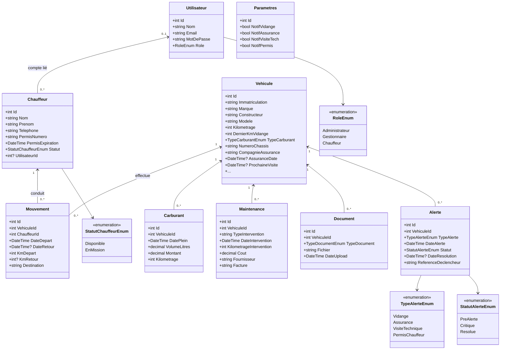
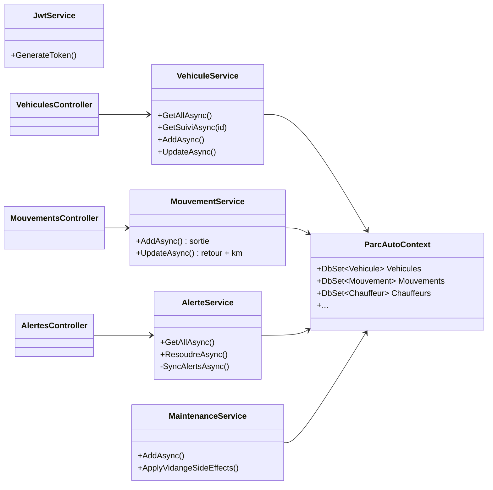

# Rapport de projet — ParckingAuto

**Système de gestion de parc automobile**  
Version : juin 2026  
Stack : ASP.NET Core 9 · Blazor WebAssembly · MySQL 8 · JWT

---

## 1. Présentation générale

**ParckingAuto** est une application web destinée à la gestion complète d’un parc de véhicules. Elle permet de suivre chaque véhicule de la flotte, d’enregistrer les entrées et sorties du parking, de gérer le carburant et la maintenance, d’archiver les documents administratifs (carte grise, assurance, factures…) et de générer des alertes automatiques (vidange, assurance, visite technique, permis chauffeur).

L’application est conçue pour le contexte tunisien : immatriculation au format `XXX TUN XXXX`, champs carte grise et attestation d’assurance.

### Objectifs fonctionnels

| Objectif | Description |
|----------|-------------|
| Suivi véhicule | Fiche complète par véhicule : identité, km, assurance, visite technique |
| Traçabilité parking | Enregistrement sortie/retour avec date, heure et kilométrage |
| Mise à jour km | Kilométrage mis à jour automatiquement au retour de mission |
| Carburant | Saisie des pleins, calcul consommation moyenne (L/100 km) |
| Maintenance | Historique interventions, coûts, factures jointes |
| Alertes | Vidange (9 000 / 10 000 km), assurance (J-30), visite technique, permis |
| Statistiques | Coûts mensuels carburant/maintenance, tableaux de bord |
| Sécurité | Authentification JWT, 3 rôles avec droits différenciés |

---

## 2. Architecture technique

```
┌─────────────────────────────────────────────────────────────┐
│                    Navigateur (Client)                       │
│              Blazor WebAssembly (Front/)                   │
│   Pages Razor · Chart.js · Bootstrap 5 · JWT localStorage   │
└──────────────────────────┬──────────────────────────────────┘
                           │ HTTPS / REST JSON
                           ▼
┌─────────────────────────────────────────────────────────────┐
│                 API ASP.NET Core 9 (ParckingAuto/)           │
│  Controllers · Services · Repositories · AutoMapper · JWT    │
└──────────────────────────┬──────────────────────────────────┘
                           │ Entity Framework Core 9
                           ▼
┌─────────────────────────────────────────────────────────────┐
│                      MySQL 8 (parc_auto)                     │
└─────────────────────────────────────────────────────────────┘

         Partagee/  ──► DTO partagés entre API et Front
```

### Structure de la solution

| Projet | Rôle |
|--------|------|
| `ParckingAuto` | API REST, modèles EF, services métier, migrations |
| `Front` | Interface Blazor WASM |
| `Partagee` | DTO communs (`VehiculeDto`, `MouvementDto`, etc.) |

### Couches backend

```
Controllers  →  Services  →  Repositories  →  ParcAutoContext  →  MySQL
     ↑
  AutoMapper (DTO ↔ Entités)
```

---

## 3. Acteurs du système

| Acteur | Description | Accès principal |
|--------|-------------|-----------------|
| **Administrateur** | Super-utilisateur : paramètres, collaborateurs, suppression | Dashboard, Settings, Utilisateurs, tout le reste |
| **Gestionnaire** | Gestion opérationnelle du parc | Véhicules, chauffeurs, mouvements, carburant, maintenance, alertes, stats |
| **Chauffeur** | Conducteur de mission | Enregistrement sortie/retour (Mes missions) |

**Compte par défaut :** `admin@parc.com` / `Parc@0`

---

## 4. Diagramme de cas d'utilisation

```mermaid
flowchart TB
    subgraph Systeme[" « ParckingAuto » "]
        direction TB

        UC_Auth["S'authentifier"]
        UC_Dash["Consulter le tableau de bord"]
        UC_Stats["Consulter les statistiques"]
        UC_Settings["Configurer les notifications"]
        UC_Users["Gérer les collaborateurs"]

        UC_Veh["Gérer les véhicules"]
        UC_Suivi["Consulter le suivi véhicule"]
        UC_Chauf["Gérer les chauffeurs"]
        UC_Mvt["Enregistrer sortie / retour parking"]
        UC_Carb["Gérer les pleins carburant"]
        UC_Maint["Gérer la maintenance"]
        UC_Doc["Archiver les documents"]
        UC_Alert["Consulter / traiter les alertes"]
    end

    Admin(("Administrateur"))
    Gest(("Gestionnaire"))
    Chauf(("Chauffeur"))

    Admin --> UC_Auth
    Gest --> UC_Auth
    Chauf --> UC_Auth

    Admin --> UC_Dash
    Admin --> UC_Stats
    Admin --> UC_Settings
    Admin --> UC_Users
    Admin --> UC_Veh
    Admin --> UC_Suivi
    Admin --> UC_Chauf
    Admin --> UC_Mvt
    Admin --> UC_Carb
    Admin --> UC_Maint
    Admin --> UC_Doc
    Admin --> UC_Alert

    Gest --> UC_Dash
    Gest --> UC_Stats
    Gest --> UC_Veh
    Gest --> UC_Suivi
    Gest --> UC_Chauf
    Gest --> UC_Mvt
    Gest --> UC_Carb
    Gest --> UC_Maint
    Gest --> UC_Alert

    Chauf --> UC_Mvt

    UC_Mvt -.->|include| UC_Veh
    UC_Suivi -.->|include| UC_Veh
    UC_Alert -.->|extend| UC_Veh
    UC_Maint -.->|extend| UC_Veh
```



### Détail des cas d'utilisation principaux

#### UC — Enregistrer sortie / retour parking
1. Le gestionnaire ou chauffeur sélectionne un véhicule **au parking** et un chauffeur **disponible**.
2. Saisie : date/heure départ, km départ, destination → **sortie enregistrée**, chauffeur passe *En mission*.
3. Au retour : date/heure retour, km retour → **km véhicule mis à jour**, chauffeur repasse *Disponible*.

#### UC — Gérer les alertes (automatique)
Le système génère des alertes lors de la consultation :
- **Vidange** : pré-alerte à 9 000 km, critique à 10 000 km depuis la dernière vidange
- **Assurance** : J-30 / J-15 / J-7 avant expiration
- **Visite technique** : idem assurance
- **Permis chauffeur** : expiration permis dans les 30 jours

#### UC — Consulter le suivi véhicule
Vue 360° : infos générales, coûts du mois, onglets mouvements / carburant / maintenance / alertes actives.

---

## 5. Diagramme de classes

### 5.1 Modèle domaine (entités)



### 5.2 Couche applicative (simplifiée)



---

## 6. Modèle de données (relations)

```
Utilisateur (1) ──optionnel──► (0..1) Chauffeur

Vehicule (1) ──► (N) Mouvement     [Restrict on delete]
Vehicule (1) ──► (N) Carburant     [Cascade]
Vehicule (1) ──► (N) Maintenance   [Cascade]
Vehicule (1) ──► (N) Document      [Cascade]
Vehicule (1) ──► (N) Alerte        [Cascade]

Chauffeur (1) ──► (N) Mouvement    [Restrict on delete]

Parametres : table singleton (1 ligne)
```

### Tables MySQL

| Table | Description |
|-------|-------------|
| `Utilisateurs` | Comptes et rôles |
| `Chauffeurs` | Conducteurs + lien utilisateur |
| `Vehicules` | Flotte (carte grise, assurance, km…) |
| `Mouvements` | Sorties/retours parking |
| `Carburants` | Pleins et consommation |
| `Maintenances` | Interventions et coûts |
| `Documents` | Fichiers archivés par véhicule |
| `Alertes` | Notifications générées |
| `Parametres` | Activation des notifications |

---

## 7. Fonctionnalités par module

### 7.1 Véhicules
- CRUD avec champs tunisiens (immatriculation `XXX TUN XXXX`, carte grise, assurance, visite technique)
- Statut dérivé : *Au parking* / *En mission*
- Suivi km depuis dernière vidange
- Page détail `/vehicule/{id}` : historique complet

### 7.2 Mouvements (parking)
- Sortie : véhicule disponible + chauffeur disponible, horodatage
- Retour : validation km, mise à jour automatique du véhicule
- Historique avec km parcourus et destination

### 7.3 Carburant
- Enregistrement plein (litres, coût, km)
- Tableau consommation moyenne L/100 km par véhicule
- Mise à jour km si supérieur à l’actuel

### 7.4 Maintenance
- Interventions multiples (vidange, freinage, carrosserie…)
- Coût, fournisseur, facture uploadée
- Vidange enregistrée → reset `DernierKmVidange` + clôture alertes

### 7.5 Alertes
- Génération synchrone à chaque consultation
- Statuts : Pré-alerte, Critique, Traitée
- Résolution manuelle (vidange → reset compteur km)

### 7.6 Dashboard & Statistiques
- KPI : véhicules, chauffeurs, alertes, coûts 6 mois
- Graphiques : litres/mois, coût maintenance/mois, coût carburant/mois, état parc
- Consommation moyenne par véhicule et par mois

### 7.7 Documents
- Upload carte grise, assurance, facture, bon réparation, visite technique
- Stockage fichiers dans `wwwroot/uploads/`

### 7.8 Paramètres (Admin)
- Activation/désactivation des 4 types de notifications

---

## 8. Sécurité

| Mécanisme | Implémentation |
|-----------|----------------|
| Authentification | JWT Bearer, expiration configurable |
| Mots de passe | BCrypt (hash `$2…`) |
| Autorisation | `[Authorize(Roles = "...")]` sur endpoints sensibles |
| CORS | Origines localhost Front autorisées |
| Rôles | Administrateur > Gestionnaire > Chauffeur |

---

## 9. API REST (principaux endpoints)

| Méthode | Route | Rôle | Action |
|---------|-------|------|--------|
| POST | `/api/Auth/login` | Public | Connexion |
| GET | `/api/Vehicules` | Tous auth | Liste véhicules |
| GET | `/api/Vehicules/{id}/suivi` | Tous auth | Suivi complet |
| POST/PUT | `/api/Vehicules` | Admin, Gest. | CRUD véhicule |
| DELETE | `/api/Vehicules/{id}` | Admin | Suppression |
| POST/PUT | `/api/Mouvements` | Tous | Sortie / retour |
| GET/POST | `/api/Carburant` | Admin, Gest. | Pleins |
| GET/POST | `/api/Maintenance` | Admin, Gest. | Interventions |
| GET/PUT | `/api/Alertes` | Admin, Gest. | Alertes |
| GET | `/api/Dashboard/*` | Auth | KPI & graphiques |
| GET | `/api/Statistiques` | Admin, Gest. | Stats mensuelles |
| PUT | `/api/Settings/update` | Admin | Paramètres |

---

## 10. Interfaces utilisateur (pages Blazor)

| Route | Page | Rôles |
|-------|------|-------|
| `/login` | Connexion | Public |
| `/dashboard` | Tableau de bord | Admin, Gest. |
| `/vehicules` | Gestion véhicules | Admin, Gest. |
| `/vehicule/{id}` | Suivi véhicule | Admin, Gest. |
| `/chauffeurs` | Gestion chauffeurs | Admin, Gest. |
| `/mouvements` | Mouvements parking | Tous |
| `/carburant` | Carburant | Admin, Gest. |
| `/maintenance` | Maintenance | Admin, Gest. |
| `/documents` | Documents | Admin |
| `/alertes` | Alertes | Admin, Gest. |
| `/statistiques` | Statistiques | Admin, Gest. |
| `/settings` | Paramètres | Admin |
| `/utilisateurs` | Collaborateurs | Admin |

---

## 11. Technologies utilisées

| Composant | Technologie |
|-----------|-------------|
| Backend | ASP.NET Core 9, EF Core 9 |
| Frontend | Blazor WebAssembly, Bootstrap 5, Chart.js |
| Base de données | MySQL 8 (Pomelo provider) |
| Auth | JWT Bearer + BCrypt |
| Mapping | AutoMapper |
| API docs | Swagger (dev) |

---

## 12. Déploiement & exécution

```bash
# API (port 7275 / 5199)
cd ParckingAuto
dotnet run

# Front Blazor WASM (port 7042)
cd Front
dotnet run
```

La base `parc_auto` est créée/migrée automatiquement au démarrage (`Database.Migrate()` + `DbInitializer.Seed()`).

---

## 13. Conclusion

**ParckingAuto** répond aux exigences d’un système de gestion de flotte automobile :

- **Traçabilité** des mouvements parking avec date/heure
- **Suivi kilométrique** automatique au retour
- **Calculs** de consommation carburant et coûts maintenance mensuels
- **Alertes proactives** vidange et assurance
- **Architecture** en couches claire (API + Blazor + DTO partagés)
- **Sécurité** par rôles JWT

Le diagramme de cas d'utilisation met en évidence trois acteurs et leurs périmètres respectifs. Le diagramme de classes centre le modèle autour de l'entité **Vehicule**, pivot de toutes les opérations du parc.

---

*Document généré pour le projet ParckingAuto — Desktop/ParckingAuto*
